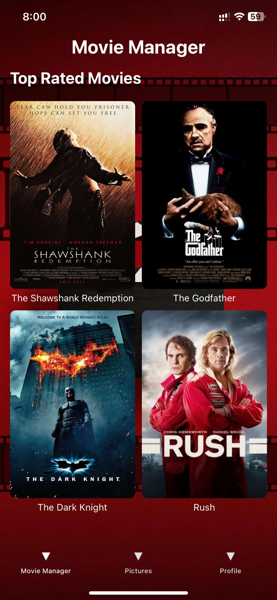
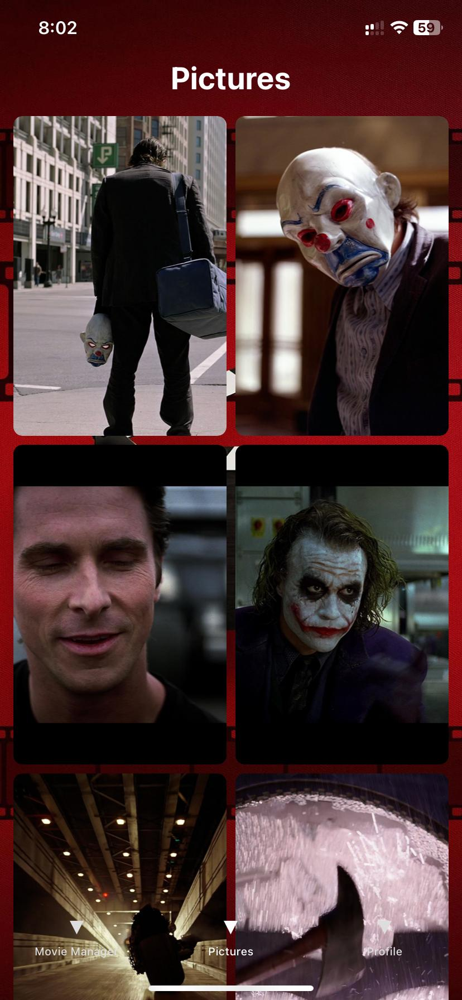
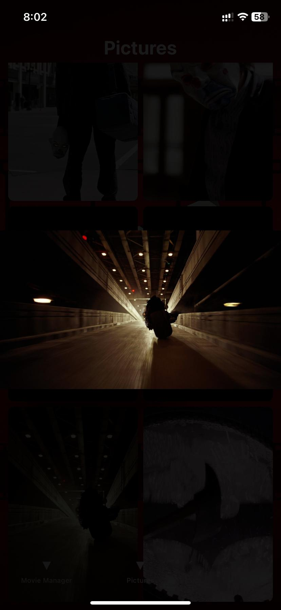
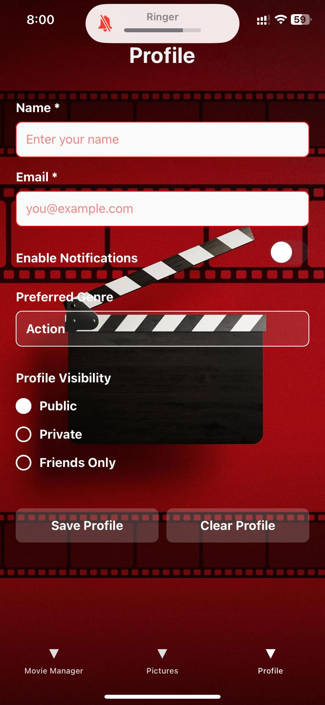
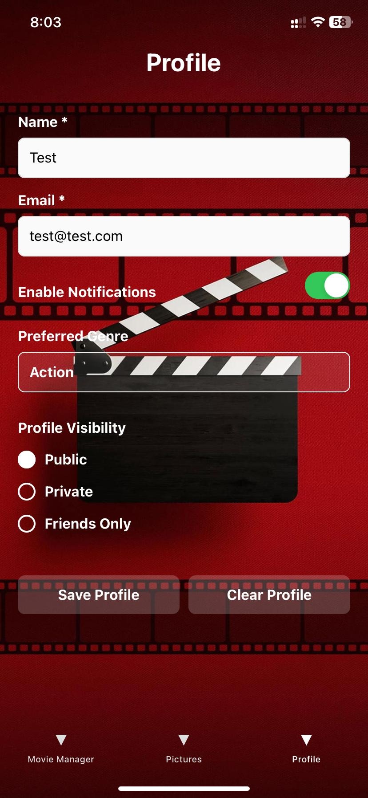
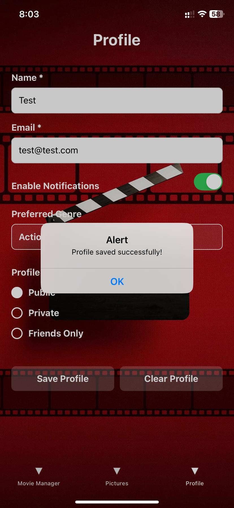
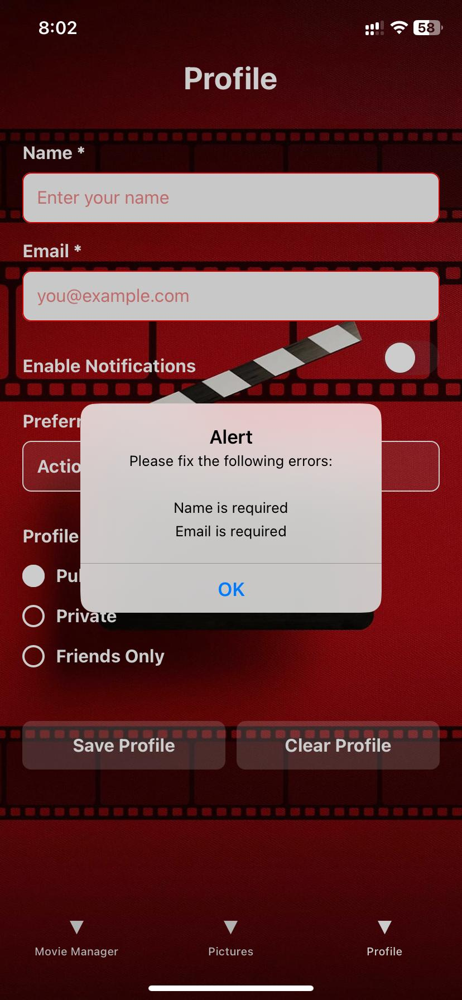
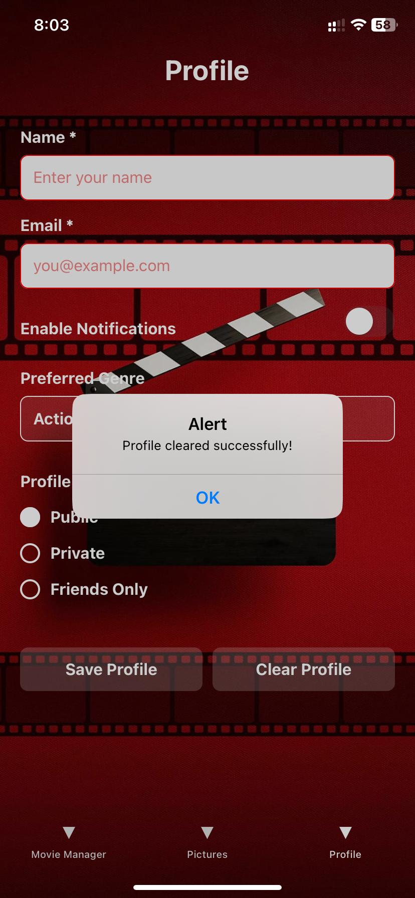

# Assignment 3

## Design and Purpose

The Movie Manager app is designed to be a sophisticated and user-friendly platform for movie enthusiasts who want to explore and learn more about top-rated films. The app features a modern, transparent UI design with a beautiful background that creates an immersive movie-browsing experience.

### Key Features:
- **Movie Gallery**: A curated collection of top-rated movies displayed in an elegant grid layout with movie posters and titles
- **Detailed Picture Galleries**: Each movie features a collection of high-quality screenshots and behind-the-scenes images that users can browse and view in full-screen mode
- **User Profiles**: Personalized user profiles where movie enthusiasts can set their preferences and manage their movie-watching experience


## Implementation Details

### Functionality

#### Gallery View
The Gallery screen presents users with a grid of top-rated movies, each displayed with a high-quality poster and title. The transparent design enhances the visual appeal while maintaining readability. <br> <br>
  

#### Picture Viewer
The Picture Viewer displays a collection of high-quality screenshots for each movie. Users can:
- View images in a responsive grid layout
- Tap to view images in full-screen mode
- Navigate between different movie scenes
- Return to gallery with clear navigation
 <br> <br>
  
  <br> <br>
  

#### Profile Management
The Profile section allows users to:
- Enter and save personal information
- Set notification preferences
- Choose favorite movie genres
- Manage profile visibility settings
- Data persistence using AsyncStorage
 <br> <br>
  
   <br> <br>
  
   <br> <br>
  

### Error Handling
Robust error handling implemented for:
- Form validation in profile management
- Image loading fallbacks
- Data persistence verification
  <br> <br>
  
   <br> <br>
  


## Project Structure
```
GalleryManager/
├── assets/
│   └── images/
│       ├── background.jpg     # App background
│       └── other movie assets # Movie thumbnails for gallery
├── screens/
│   ├── GalleryScreen.js    # Main movie grid display
│   ├── PicturesScreen.js   # Movie-specific image gallery
│   └── ProfileScreen.js    # User profile management
├── App.js                  # Main application setup and navigation
├── app.json               # Expo configuration
├── package.json          # Dependencies and scripts
└── README.md            # Project documentation
```

### Key Components:
- **App.js**: Sets up navigation and main app structure with bottom tabs
- **GalleryScreen**: Displays the grid of movie thumbnails and titles
- **PicturesScreen**: Handles the movie-specific image galleries with full-screen viewing capability. Uses remote URLs to fetch high-quality movie screenshots
- **ProfileScreen**: Manages user profile data and preferences with AsyncStorage
- **assets/**: Contains app background and gallery thumbnails

### Image Management:
- Gallery thumbnails are stored locally for fast initial loading
- Movie screenshots are fetched from remote URLs for:
  - Reduced app size
  - Access to high-quality images
  - Dynamic content updates
  - Efficient storage management 
