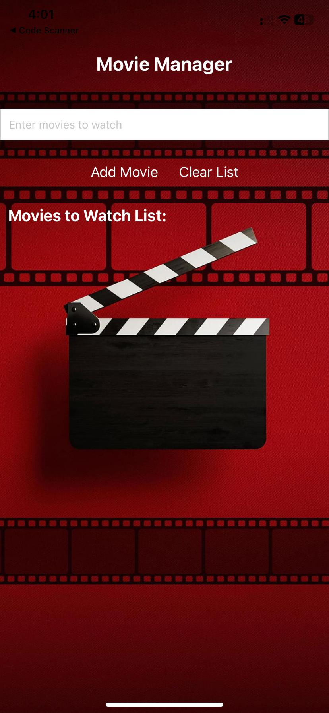
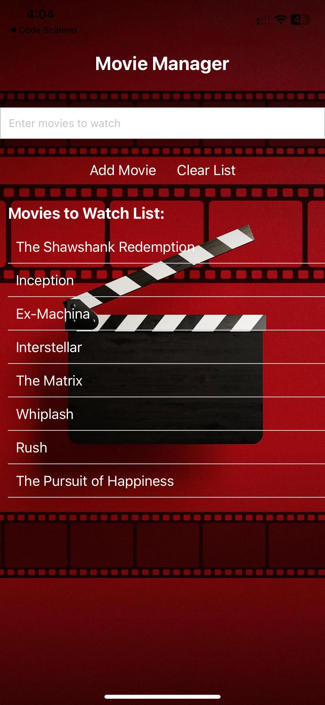
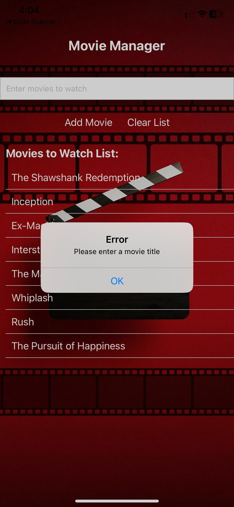
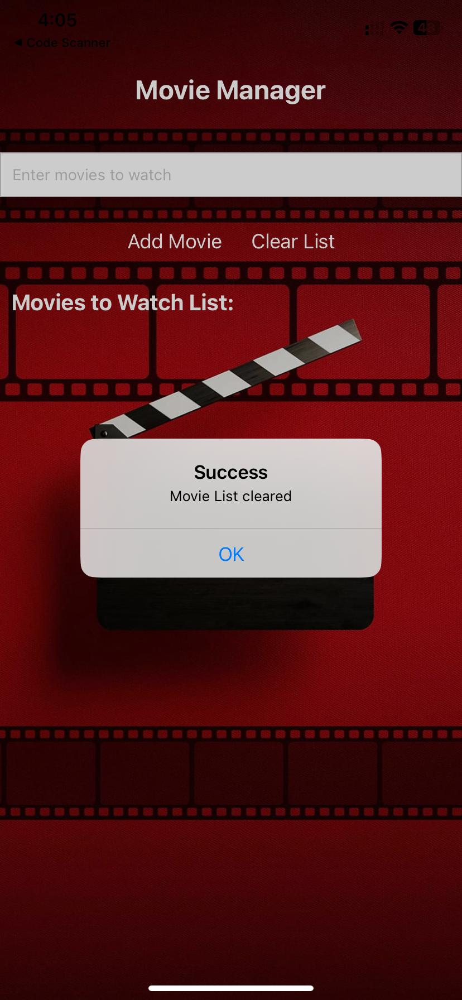

# INFO-670
## Assignment 2

### Requirements
#### 1. App Design and Purpose:
* Purpose of list application:  You can easily add films to your personalized watchlist, stay updated on upcoming releases, and organize your cinematic interests in one place. Whether you're a casual viewer or a film enthusiast, Movie Manager helps you stay on top of your movie-watching goals and discover new favorites.
* User layout screenshot below:    
  

#### 2. Core Functionality
* Used TextInput and Button components to allow users to add movies to list. 
* Screenshot of movies added to list below:  
  

#### 3. Error Handling
* Appropriate error handling done to show error message if user tries to add movie without entering movie name. 
* Screenshot of error below:  
  

#### 4. Additional Feature:
* Clear button allows user to clear all movies in the list and start again.
* Screenshot of clear list below:   
  
