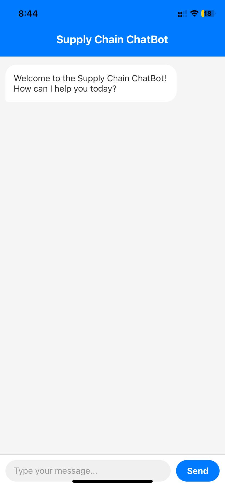
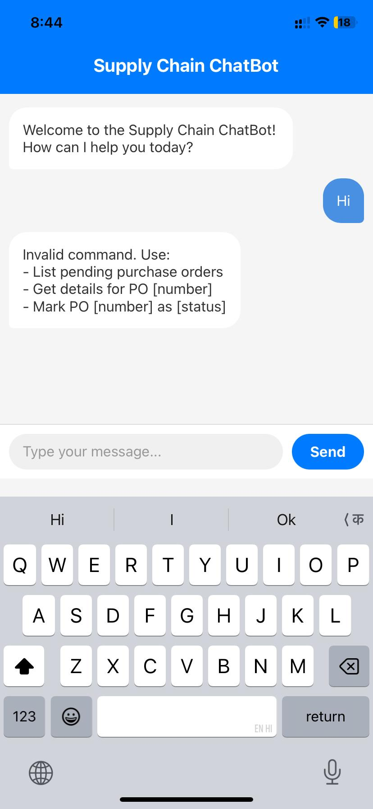
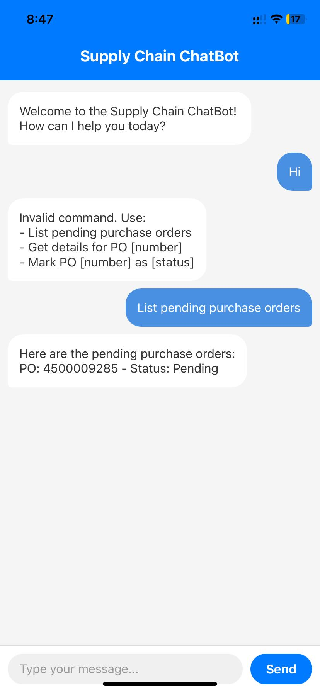
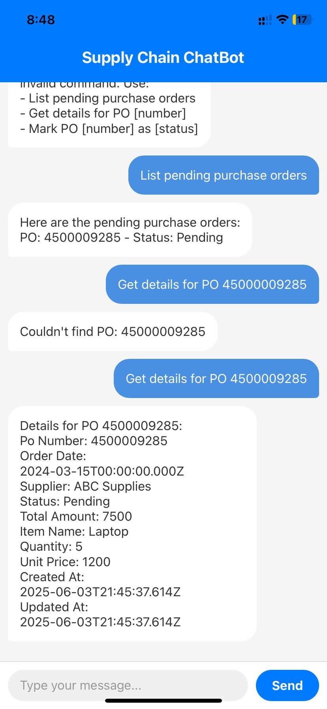
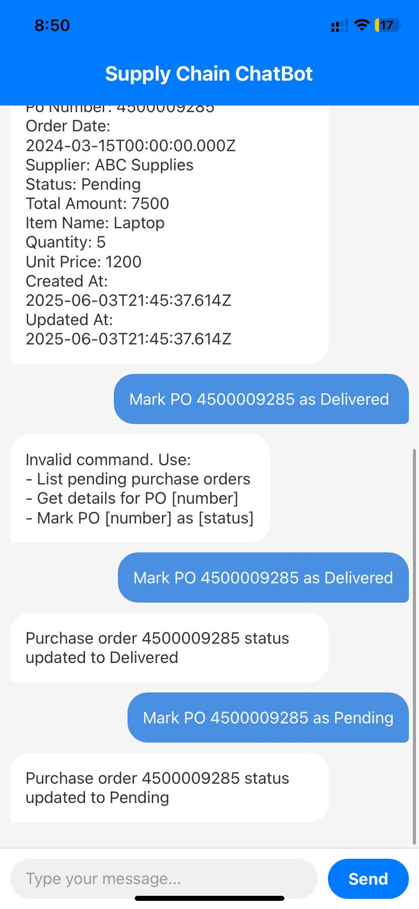

# Supply Chain ChatBot

A React Native mobile application with a Node.js backend for managing supply chain purchase orders through a chat interface.

## Prerequisites

### 1. Node.js and npm
- Install Node.js (v14 or higher) from [nodejs.org](https://nodejs.org/)
- npm comes bundled with Node.js
- Verify installation:
  ```bash
  node --version
  npm --version
  ```

### 2. MongoDB
- Install MongoDB Community Server from [Download MongoDB Community Server](https://www.mongodb.com/try/download/community?tck=docs_server)
- Start MongoDB service on your system
- Verify installation:
  ```bash
  mongod --version
  ```
## Project Setup

### 1. Clone the Repository
```bash
git clone <repository-url>
cd SupplyChainChatBot
```

### 2. Backend Setup
1. Navigate to the server directory:
   ```bash
   cd server
   ```

2. Install dependencies:
   ```bash
   npm install
   ```

3. Create a `.env` file in the server directory:
   ```
   PORT=3000
   MONGODB_URI=mongodb://localhost:27017/supplychain
   ```

4. Run the database setup script. This will setup mongodb schema and load sample data.
   ```bash
   node setup.js
   ```

5. Start the server:
   ```bash
   npm start
   ```

### 3. Frontend Setup
1. In the root directory, install dependencies:
   ```bash
   npm install
   ```

2. Update the IP address in App.js
   ```bash
   const defaultIP = '192.XXX.X.XXX';
   ```
3. Start the React Native app:
   ```bash
   npx expo start
   ```
4. If you face error - _"java.io.IOException: Failed to download remote update"_, then start the app using below command:
   ```bash
   npx expo start --tunnel
   ```

5. Run the app:
   - Scan QR code with Expo Go app (Android) or Camera app (iOS)
   - Press 'a' to run on Android emulator
   - Press 'i' to run on iOS simulator (Mac only)

## Project Structure

```
SupplyChainChatBot/
├── server/                 # Backend server
│   ├── models/            # MongoDB models
│   ├── routes/            # API routes
│   ├── setup.js           # Database setup script
│   └── server.js          # Main server file
├── config.txt             # Configuration file for IP address
└── App.js                 # React Native frontend
```

## Requirements

### 1. Front-end


#### Chat Interface
<div style="display: flex; justify-content: space-between; margin: 20px 0;">
    <div style="width: 30%;">
        
    </div>
    <div style="width: 30%;">
        
    </div>
</div>

#### Purchase Order List
  <div style="width: 30%;">
      
  </div>

#### Purchase Order Details
  <div style="width: 30%;">
      
  </div>

#### Purchase Order Status Update
  <div style="width: 30%;">
      
  </div>


### 2. Server APIs

#### Purchase Orders Endpoints

1. **Get All Purchase Orders**
   - Endpoint: `GET /api/purchase-orders`
   - Description: Retrieves all purchase orders from the database
   - Response Example:
     ```json
     {
       "status": "success",
       "data": [
         {
           "poNumber": "4500009285",
           "status": "Pending",
           "createdAt": "2024-03-20T10:00:00.000Z",
           "updatedAt": "2024-03-20T10:00:00.000Z"
         }
       ]
     }
     ```

2. **Get Pending Purchase Orders**
   - Endpoint: `GET /api/purchase-orders/pending`
   - Description: Retrieves all purchase orders with 'Pending' status
   - Response Example:
     ```json
     {
       "status": "success",
       "data": [
         {
           "poNumber": "4500009285",
           "status": "Pending",
           "createdAt": "2024-03-20T10:00:00.000Z",
           "updatedAt": "2024-03-20T10:00:00.000Z"
         }
       ]
     }
     ```

3. **Get Purchase Order by ID**
   - Endpoint: `GET /api/purchase-orders/:id`
   - Parameters:
     - `id` (path parameter): Purchase Order number
   - Description: Retrieves a specific purchase order by its PO number
   - Response Example:
     ```json
     {
       "status": "success",
       "data": {
         "poNumber": "4500009285",
         "status": "Pending",
         "createdAt": "2024-03-20T10:00:00.000Z",
         "updatedAt": "2024-03-20T10:00:00.000Z"
       }
     }
     ```
   - Error Response (404):
     ```json
     {
       "status": "error",
       "message": "Purchase order not found"
     }
     ```

4. **Update Purchase Order Status**
   - Endpoint: `PUT /api/purchase-orders/:id/status`
   - Parameters:
     - `id` (path parameter): Purchase Order number
     - `status` (body parameter): New status value
   - Request Body:
     ```json
     {
       "status": "Approved"
     }
     ```
   - Valid Status Values: "Pending", "Approved", "Delivered", "Cancelled"
   - Response Example:
     ```json
     {
       "status": "success",
       "message": "Purchase order 4500009285 status updated to Approved",
       "data": {
         "poNumber": "4500009285",
         "status": "Approved",
         "createdAt": "2024-03-20T10:00:00.000Z",
         "updatedAt": "2024-03-20T10:05:00.000Z"
       }
     }
     ```
   - Error Responses:
     - Invalid Status (400):
       ```json
       {
         "status": "error",
         "message": "Invalid status. Must be one of: Pending, Approved, Delivered, Cancelled"
       }
       ```
     - Not Found (404):
       ```json
       {
         "status": "error",
         "message": "Purchase order not found"
       }
       ```

#### Error Handling
All endpoints may return the following error response in case of server errors:
```json
{
  "status": "error",
  "message": "Error description",
  "error": "Detailed error message"
}
```

#### Data Handling
- MongoDB integration for persistent storage
- Input validation and sanitization
- Error handling with appropriate status codes
- Response formatting and data transformation

### 3. Database/Datastore Integration

#### Database Schema

##### PurchaseOrder Collection
```javascript
{
  poNumber: {
    type: String,
    required: true,
    unique: true,
    description: "Unique identifier for the purchase order"
  },
  orderDate: {
    type: Date,
    required: true,
    description: "Date when the purchase order was created"
  },
  supplier: {
    type: String,
    required: true,
    description: "Name of the supplier for this purchase order"
  },
  status: {
    type: String,
    enum: ['Pending', 'Approved', 'Delivered', 'Cancelled'],
    default: 'Pending',
    description: "Current status of the purchase order"
  },
  totalAmount: {
    type: Number,
    required: true,
    description: "Total monetary value of the purchase order"
  },
  itemName: {
    type: String,
    description: "Name of the item being ordered"
  },
  quantity: {
    type: Number,
    description: "Quantity of items ordered"
  },
  unitPrice: {
    type: Number,
    description: "Price per unit of the item"
  },
  createdAt: {
    type: Date,
    default: Date.now,
    description: "Timestamp when the record was created"
  },
  updatedAt: {
    type: Date,
    default: Date.now,
    description: "Timestamp when the record was last updated"
  }
}
```

#### Schema Features
- **Required Fields**: poNumber, orderDate, supplier, totalAmount
- **Unique Constraints**: poNumber must be unique
- **Default Values**: 
  - status defaults to 'Pending'
  - createdAt and updatedAt default to current timestamp
- **Automatic Updates**: updatedAt is automatically updated on save
- **Validation**:
  - status must be one of: 'Pending', 'Approved', 'Delivered', 'Cancelled'
  - All required fields must be present
  - poNumber must be unique

#### Database Implementation
- MongoDB as the primary database
- Mongoose ODM for schema definition and validation
- Automatic timestamp management
- Built-in support for JSON data structures
- Efficient querying and indexing
- Data validation and type checking

## Available Commands

The chat interface supports the following commands:

1. List pending purchase orders:
   - "List pending purchase orders"
   - "Show pending purchase orders"

2. Get purchase order details:
   - "Get details for PO [number]"
   - PO number must be 5 or more digits
   - Example: "Get details for PO 4500009285"

3. Update purchase order status:
   - "Mark PO [number] as [status]"
   - PO number must be 5 or more digits
   - Available statuses: pending, approved, delivered, cancelled
   - Example: "Mark PO 4500009285 as Delivered"

Note: All commands are case-insensitive, but the PO number must be exact and the status must match one of the available options.

